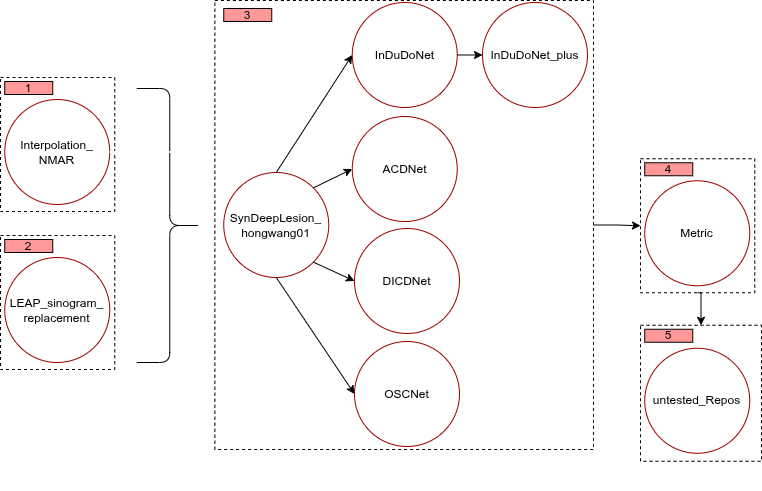
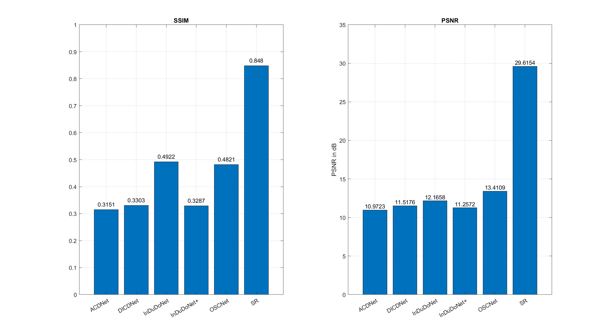

# Metal Artifact Reduction (MAR)

This repository contains a collection of open-source Metal Artifact Reduction (MAR) algorithms. In addition to the source code, it provides step-by-step guides on how to test the algorithms with custom data and troubleshoot common issues.

To better understand our overall strategy and how we approach solving the MAR problem, please refer to the following roadmap. It provides a structured overview and helps you navigate the project effectively:

  

<em>Figure 1: Overview of the MAR algorithm roadmap.</em>

---

## Performance Evaluation

By following the [metric instructions](./metric/), we obtain the following evaluation results comparing different algorithms:

  

<em>Figure 2: Comparison of MAR Methods with PSNR and SSIM.</em>

